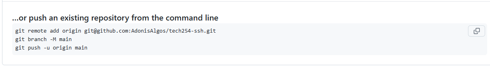

# Learning Git & Github

## Introduction to git
- [Learning Git \& Github](#learning-git--github)
  - [Introduction to git](#introduction-to-git)
  - [Task: Learning GitHub](#task-learning-github)
  - [Connect to GitHub through SSH](#connect-to-github-through-ssh)
    - [Linking GitHub to a key](#linking-github-to-a-key)
    - [On your Terminal Window](#on-your-terminal-window)
    - [Next steps on GitHub](#next-steps-on-github)
  - [Task: Re-create SSH setup to authenticate to GitHub with a pre-existing repo with a HTTPS connection.](#task-re-create-ssh-setup-to-authenticate-to-github-with-a-pre-existing-repo-with-a-https-connection)
    - [Delete test repo and SSH key.](#delete-test-repo-and-ssh-key)
    - [Generate an SSH key, use a pre-existing repo to switch over to use an SSH connection.](#generate-an-ssh-key-use-a-pre-existing-repo-to-switch-over-to-use-an-ssh-connection)
  - [Task: Document 'Use SSH authentication with a repo on GitHub'](#task-document-use-ssh-authentication-with-a-repo-on-github)
    - [Delete test repo and SSH key.](#delete-test-repo-and-ssh-key-1)
    - [Create a new local repo](#create-a-new-local-repo)


Check you have git on your machine `git --version`

Create your first Git repo named 'tech264-test-git'
1. Create 'tech264-test-git' folder as usual.
2. Open a terminal and change directories to point to the folder,
3. Run the command to initiate a git repo `git init`

Create a README.md file via the IDE

Do your first commit
1. Run `git status` to confirm the added file is in a modified stage.
2. Stage the file by running `git add .` (adding the . stages all unstaged files).
3. Make commit and associate it with a message `git commit -m "My first commit"`
4. Run `git status` to confirm repo state.

Make changes to README.md file and do another commit.
* Edit file and follow 'Do your first commit' steps.

Check differences between commits
1. Run `git log` to display the logging info for both commits.
2. Find the hash id associated with each commit log.
3. Run `git diff <hash-id1> <hash-id2>`
4. Alternatively, to check the difference between the most recent and previous commit run `git diff HEAD^ HEAD`

Use `git checkout` to point to the previous commit and then back to the most recent commit.
1. Find each commits id.
2. To point to another commit run `git checkout <hash-id>` (run the command for both commits)

Restore a specific file to its state in a previous commit
1. Find the commit id of the state where the file should be restored to.
2. Run `git checkout <hash-id> -- <file-name>` or `git checkout HEAD~1 -- <file-name>`
3. Note: The file now should be at a staged state, commit the file!

## Task: Learning GitHub

Given that we have created an account on GitHub we can follow the below steps to set up our online repo:

1. Create a new repository.
2. Give it a name - if attempting to copy a local repo to this online repo give it the same name as the local repo.
3. Ensure it is Public if wanting others to have access or Private for private usage
4. Confirm creation

Set up by creating a new repository on the command line

* `git init` Initialise repository.
* `git branch -M main` Rename standard master branch to main.
* `git remote add origin https://github.com/AdonisAlgos/ONLINE_REPO_NAME`
* `git push -u origin main`

Set up by pushing an existing repository from the command line

* `git remote add origin https://github.com/AdonisAlgos/ONLINE_REPO_NAME`
* `git branch -M main`
* `git push -u origin main`

What are some things we want to ignore?

* Sensitive (passwords, etc) personal files
* Large files/folders that don't need to be pushed
* Build folders (/bin, /out, etc)

To do this we can create a .gitignore file and define file/folder names that from that point onwards will
prevent git from tracking these files/folders.

**IMPORTANT!** 
To achieve this, we can create a .gitignore file and specify the file or folder names that should be ignored. 
From that point forward, Git will stop tracking the specified files or folders.

**IMPORTANT!**
If the file or folder has been previously been commited it can be removed by running ` git rm --cached  -r <file_or_folder_name>`

**IMPORTANT**
If the file or folder is still accessible in previous versions we can action as follows:

Option 1: 
* Remove previous commits with that file. (e.g. use 'git reset' DANGEROUS)

Option 2: 
1. Remove GitHub repo (Now safe!).
2. Remove sensitive information from your local file.
3. Remove .git folder from your local repo.

## Connect to GitHub through SSH

### Linking GitHub to a key

1. Generate a new SSH key.
   1. Navigate to the `.ssh/` folder within the `home` directory (if one doesn't exist create one).
   2. Run `ssh-keygen -t rsa -b 4096 -C "your email address"` to generate the public and private key pair.
2. Print the **public** key using `cat`. This will be given to GitHub.
3. Navigate to your **Settings** on GitHub.
4. Find **SSH Keys and GPG keys** and add **New SSH key**.
5. Name the key appropriately.
6. Insert what you printed and save.
 
### On your Terminal Window

1. Input the below command to start the SSH agent.

```bash
eval `ssh-agent -s`
```

2. Register your `private key` with ssh. This will add your identity.

```bash
ssh-add <key-file-name>
```

3. **Test** your connection to GitHub using

```bash
ssh -T git@github.com
```

1. You will either get a prompt to then type `yes`, or it will say you're successfuly authenticated. This works in any directory.
 
### Next steps on GitHub
1. Once the repo is created (*needs to match the local git repo*), change quick setup option from **HTTPS** to **SSH**.
2. Follow the GitHub instructions on the page, ensuring that the GitHub link does **NOT** start with **HTTPS**.

## Task: Re-create SSH setup to authenticate to GitHub with a pre-existing repo with a HTTPS connection.

### Delete test repo and SSH key.

1. Deleted `tech264-adonis-github-test` repo from github and local directory.
2. Navigated to **Account** > **Settings** > **SSH and GPG keys** and **delete** the SSH key.
3. Locally we cd ~/.ssh and delete the newlly created ssh key pair.

### Generate an SSH key, use a pre-existing repo to switch over to use an SSH connection.

1. We generate a new SSH key pair and sore them as `tech264-adonis-github-key`.
2. We publish the publib ssh key on GitHUb within the **SSH and GPG keys** section on Github.
3. Register the `private key` with ssh.

```bash
ssh-add tech264-adonis-github-key
```
4. Test the connection with GitHub

```bash
$ ssh -T git@github.com
```
5. Navigate to a current active github repo on the local machine already connected with the remote repo.

6. Run the `git remote -v` command to display the connection type of my Git repository. This command lists all configured remote repositories along with their URLs, which helps me see if my repository is connected via HTTPS or SSH. If the URL starts with `https://`, it’s using an HTTPS connection. If it starts with `git@` (e.g., git@github.com:username/repo.git), it’s using SSH.

```bash
git remote -v
```

7. Within the Github repo there is a **Code** drop down that proviides the SSH origin connection. Run the below command accompanied with the SSH connection to switch origin from HTTPS to SSH. *Note: The command must be ran in whilst within the local repo*.

```bash
git remote set-url origin git@github.com:AdonisAlgos/tech264-test-git.git
```

## Task: Document 'Use SSH authentication with a repo on GitHub'

### Delete test repo and SSH key.

1. Deleted `tech264-adonis-github-test` repo from github and local directory.
2. Navigated to **Account** > **Settings** > **SSH and GPG keys** and **delete** the SSH key.
3. Locally we cd ~/.ssh and delete the newlly created ssh key pair.

### Create a new local repo

1. Navigate to the local location where the repo should live.
2. Create a folder.

```bash
mkdir tech254-ssh
```

3. Initialise it as a git repo.

```bash
git init
```

4. Create a blank README.md file.

```bash
touch README.md
```

5. Add and commit changes to repo.

```bash
git add .
git commit -m "First commit"
```

6. We generate a new SSH key and link it to our GitHub account.
   * Steps documented at section --> **Connect to GitHub through SSH**
7. After creating the GitHub repo there will be a **Code** dropdown button to be clicked. When clicked, select the SSH tab which would modify the instructions given by Github.



1. Navigate to the section that specifies pushing an existing local repo and copy the commands.
2.  Finally we ensure to be navigated within our local git repo and push our local repo status to the remote repo.

```bash
git remote add origin git@github.com:AdonisAlgos/tech254-ssh.git
git branch -M main
git push -u origin main
```
